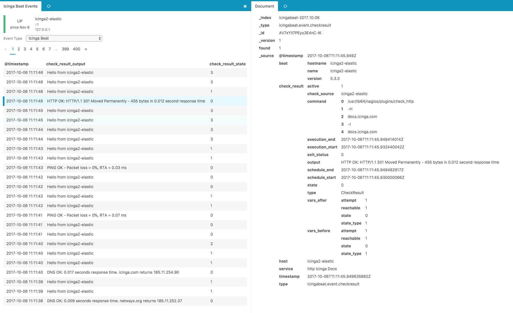

# Elasticsearch Module for Icinga Web 2

1. [About](#about)
2. [Requirements](#requirements)
3. [License](#license)
4. [Getting Started](#getting-started)
5. [Documentation](#documentation)
6. [Contributing](#contributing)

## About

The Elasticsearch Module for Icinga Web 2 integrates your [Elastic](https://www.elastic.co/) stack into
[Icinga Web 2](https://www.icinga.org/products/icinga-web-2/). Based on
[Elasticsearch](https://www.elastic.co/products/elasticsearch) instances and event types you configure, the module
allows you to display data collected by [Beats](https://www.elastic.co/products/beats),
[Logstash](https://www.elastic.co/products/logstash) and any other source. After you've installed and configured the
module, you can browse events via the host action **Elasticsearch Events**.

## Requirements

* Icinga Web 2 version 2.4.2+
* PHP version 5.6.x or 7.x
* php-curl

## License

The Elasticsearch Module for Icinga Web 2 is licensed under the terms of the GNU
General Public License Version 2, you will find a copy of this license in the
[COPYING](COPYING) file included in the source package.

## Getting Started

Please have a look at our [installation instructions](doc/01-Installation.md) and how to
[configure](doc/02-Configuration.md) the module.

## Documentation

A complete list of all our documentation can be found in the [doc](doc/) directory.

## Contributing

There are many ways to contribute to Icinga -- whether it be sending patches,
testing, reporting bugs, or reviewing and updating the documentation. Every
contribution is appreciated!
