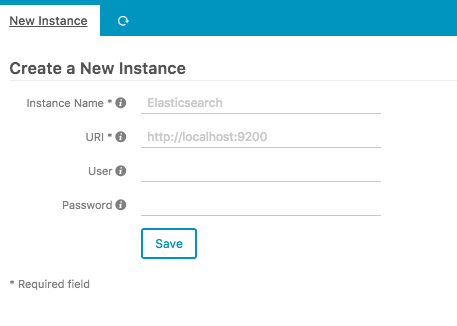

# Configuration

This chapter will give you the very basics to get the Elasticsearch module for Icinga Web 2 up and running. 

## Elasticsearch Instances

The first step to take here is to define how to connect to your Elasticsearch instances. Using the web interface is
the preferred method of configuration. Please access `Configuration -> Modules -> elasticsearch -> Instances` in order
to set up a new Elasticsearch instance.




| Option                | Required | Description                         |
| --------------------- | -------- | ----------------------------------- |
| Name                  | **yes**  | Name of the Elasticsearch instance. |
| URI                   | **yes**  | URI of the Elasticsearch instance.  |
| User                  | no       | Username                            |
| Password              | no       | Password                            |
| Certificate Authority | no       | The path of the file containing one or more certificates to verify the peer with or the path to the directory that holds multiple CA certificates. |
| Client Certificate    | no       | The path of the client certificate. |
| Client Private Key    | no       | The path of the client private key. |

## Event Types

Event types define how to access data in your Elasticsearch instances. Again, please use the web interface for
configuration and access `Configuration -> Modules -> elasticsearch -> Event Types`.


| Option                | Required | Description                                     |
| --------------------- | -------- | ----------------------------------------------- |
| Name                  | **yes**  | Name of the event type.                         |
| Instance              | **yes**  | Elasticsearch instance to connect to.           |
| Index                 | **yes**  | Elasticsearch index pattern, e.g. `filebeat-*`. |
| Filter                | **yes**  | Elasticsearch filter in the Icinga Web 2 URL filter format. Host macros are evaluated if you encapsulate them in curly braces, e.g. `host={host.name}&location={_host_location}`. |
| Fields                | **yes**  | Comma-separated list of field names to display. One or more wildcard asterisk (`*`) patterns are also accepted. Note that the `@timestamp` field is always respected. | 

### Examples

Some examples that may help you to create your own Event Types. You can either use the webinterface or copy the
configuration directly into `/etc/icingaweb2/modules/elasticsearch/eventtypes.ini`.

#### Filebeat

```ini
[Filebeat]
instance = "Elasticsearch"
index = "filebeat-*"
filter = "beat.hostname={host.name}"
fields = "input_type, source, message"
```

#### Logstash with Syslog Filter
This Logstash example is based on the configuration examples of the [Logstash documentation](https://www.elastic.co/guide/en/logstash/current/config-examples.html).

```ini
[Logstash]
instance = "Elasticsearch"
index = "logstash-*"
filter = "syslog_hostname={host.name} AND type=syslog"
fields = "syslog_timestamp, syslog_program, syslog_message"
```

